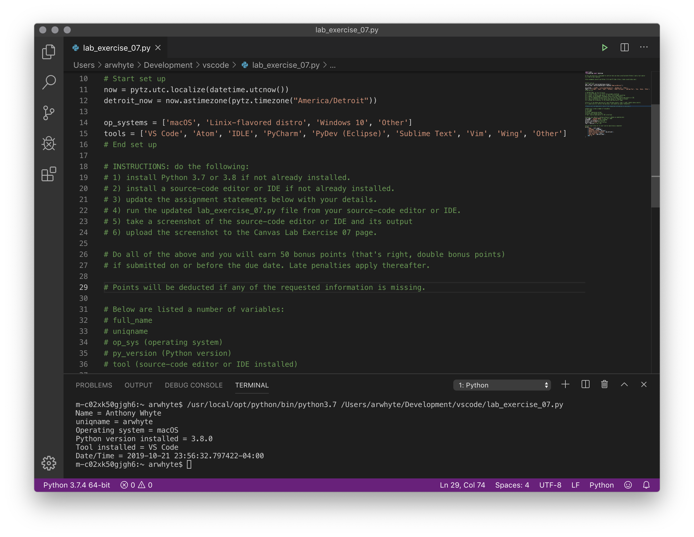

# Lab Exercise 07

Note: there is no auto grader required for Lab exercise 07. A screenshot of the student's source-editor or IDE 
running `lab_exercise_07.py` in the terminal is all that is required.

See `lab_exercise_07.py` for instructions. 

Example screen shot:

