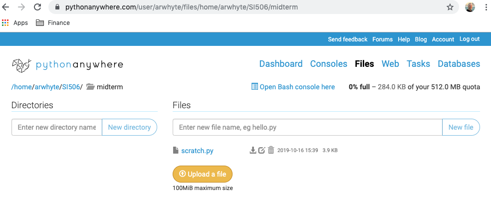
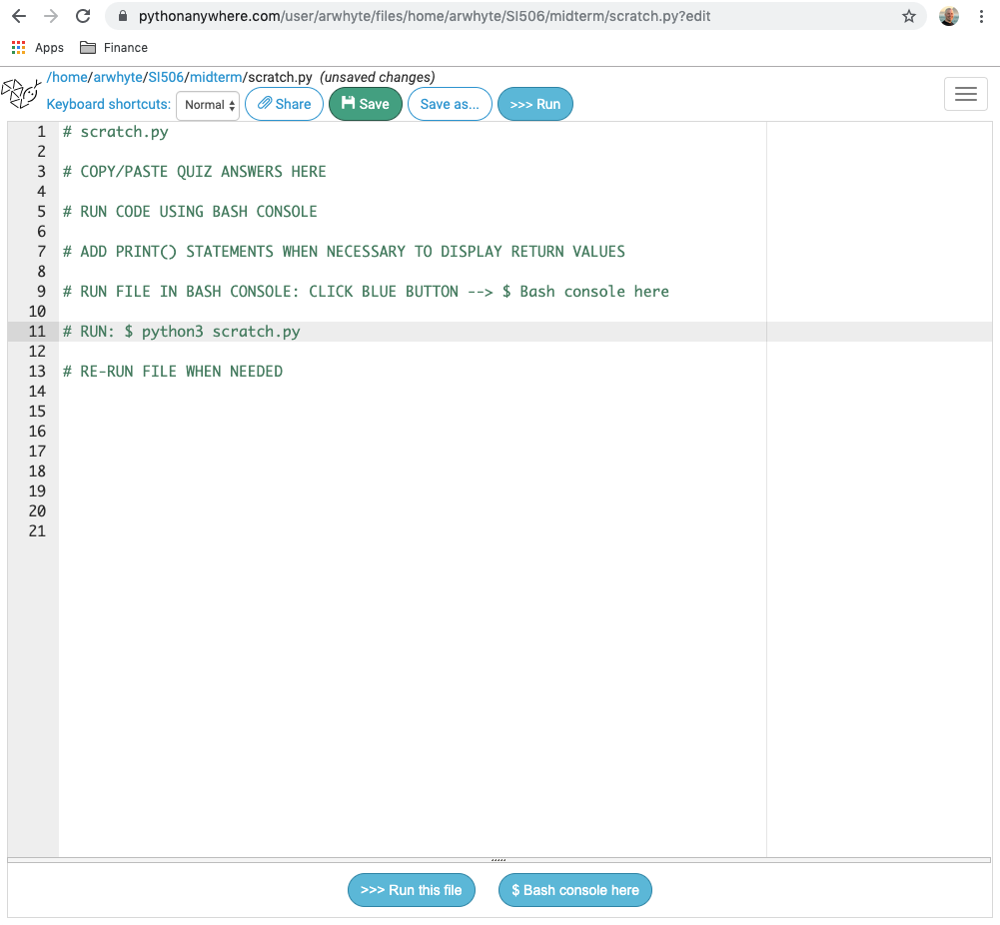
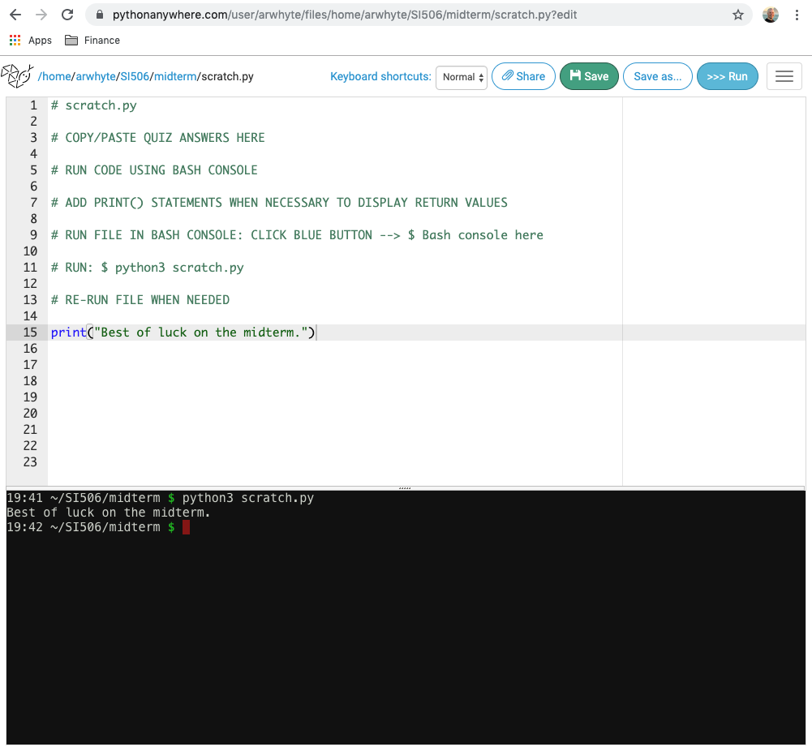
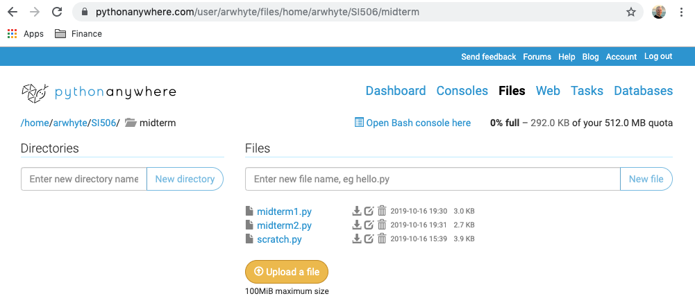
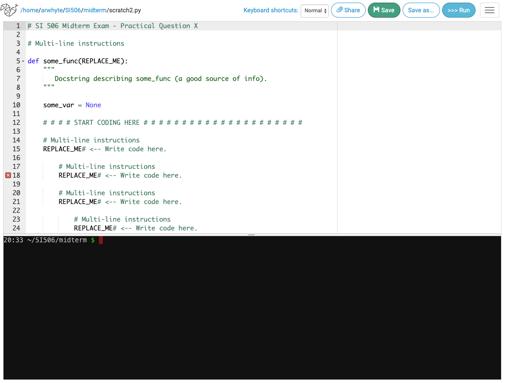

# Midterm Exam Guide
## SI 506, Fall 2019
This exam is open network, open readings, open notes, open slide decks. You may refer to code in previous lecture exercises, lab exercises, and problem sets for inspiration.

Please arrive a few minutes early.  Make sure your personal laptop is fully charged.  Choose a seat with an empty seat on either side.  

You are prohibited from soliciting assistance or accepting assistance from any person while taking the exam. The midterm exam quiz and problem that you submit _must_ be your own work.

Likewise, you are prohibited from assisting any other student required to take this exam.  This includes those taking the exam on Thursday, 17 October 2019, as well as those who may take the exam at another time and/or place due to scheduling conflicts or other issues.

## Midterm parts
The midterm exam consists of two parts: a quiz and a coding problem.

### Quiz (500 points)
The quiz consists of __12 multiple choice questions__. The questions are drawn from a number of question banks and are randomized for each student attempt. The Canvas quiz engine will serve up one question per screen. You can navigate back and forth between the previous and next questions while working on the quiz. 

You will be permitted a single quiz attempt. The quiz must be submitted before the exam time ends in order to earn points. Once you submit the Canvas quiz for scoring please switch to working on the coding problem that you will submit to Gradescope.

Ten (10) questions are worth 35 points each. Two (2) questions are worth 75 points each.

The quiz must be submitted to Canvas for scoring before the expiration of exam time. Quizzes submitted after the expiration of exam time will receive a zero score.

### Coding Problem (500 points)
Two coding problems are provided.  Choose __one__ and only one to complete.

You will retrieve the problem files from Canvas Modules or Files. Review each problem quickly and decide which problem you will work on.

Both problems involve breathing life into a skeletal function by inserting  a _single_ line of code (or missing arguments in the case of missing function parameters) whenever a `_REPLACE_ME` placeholder is encountered in the function body. Each `_REPLACE_ME` will describe exactly what operation the line of code you insert must accomplish.

Each problem resembles the following skeletal implementation (verbose multi-line instructions are reduced to a single line in the example):

```python
# SI 506 Midterm Exam - Practical Question X

# Multi-line instructions

def some_func(REPLACE_ME):
    """
       Docstring describing some_func (a good source of info).
    """

    some_var = None

    # # # # START CODING HERE # # # # # # # # # # # # # # # # # # # # #

    # Multi-line instructions
    REPLACE_ME# <-- Write code here.

        # Multi-line instructions
        REPLACE_ME# <-- Write code here.

        # Multi-line instructions
        REPLACE_ME# <-- Write code here.

            # Multi-line instructions
            REPLACE_ME# <-- Write code here.

                # Multi-line instructions
                REPLACE_ME# <-- Write code here.

    # # # # # STOP CODING HERE # # # # # # # # # # # # # # # # # # # # #
    # Don't change anything below this line!

    return something

# Use the below lines to test your function.

another_var = None
yet_another_var = some_func(some_arg, maybe_another_arg)
print(f"yet_another_var = {yet_another_var}")
```

## Submitting the coding problem
You _must_ submit your solution file to _Gradescope_ before the expiration of exam time. Solution files submitted after the expiration of exam time will receive a zero score.

You may __resubmit__ your problem solution to Gradescope as many times as needed before the expiration of exam time. Your final submission will constitute your exam submission.

## Auto grader / manual scoring
If the auto grader is unable to grade your submission successfully with a score of 500 points, do not fear, we will grade your submission __manually__. Partial credit will be awarded for partial submissions that otherwise fail the auto grader.

If you submit a partial solution, please include (if you have time) Python comments that explain what you were attempting to accomplish in the area(s) of the function body that are not working properly. We will review your comments when determining partial credit. Also, if your function fails to execute properly, adding debug `print()` statements that show the parts that are working will also help us in our review.

## Exam tips

### Browser setup
Consider opening a browser tab for each of the following resources _before_ commencing the exam:

| Browser tab | URL | Note |
| :---------- | :-- | :--- |
| Midterm Exam Guide | https://github.com/umsi-arwhyte/SI506-2019Fall/blob/master/docs/midterm/midterm_guide.md | Guide |
| Instructure Canvas | https://umich.instructure.com/courses/321528 | See Canvas Modules for the link to the midterm Quiz and problems. |
| pythonanywhere | https://www.pythonanywhere.com | Do the midterm problem here (unless running Python locally); a `scratch.py` file may also prove useful during the quiz portion of the exam. |
| Python operators | https://www.w3schools.com/python/python_operators.asp | Operators reference |
| Python string methods | https://www.w3schools.com/python/python_ref_string.asp | String methods reference |
| Python list methods | https://www.w3schools.com/python/python_ref_list.asp | List method reference |

You may want to augment this minimal set up with tabs open to other Python resources. Don't over do it. Too many tabs open could prove confusing.

### Quiz
When answering individual questions, you may check your answer by copying the code to a Python "scratch.py" file, correcting the code as necessary, and running the file in the __Bash shell__ to confirm your answer.  Be wary of doing this for all questions; you may end up reducing the time you need to complete the coding problem. The clock is not your friend.

### Problem
Make frequent use of `print()` statements to print out values as you are working on the problem. To test the file, 
run it in the Bash shell and confirm it is working before submitting it to Gradescope.

If you cannot get the problem working submit to Gradescope anyways before the expiration of exam time and we will 
grade it manually.

### Abbreviations
Do not confuse example values denoted as (e.g., 'hello world') for actual values
to be referenced directly in a question or problem. The abbreviation e.g. translates to the Latin _exempli gratia_ 
('for example').

## pythonanywhere setup
If you work in the pythonanywhere.com environment the following setup information should prove useful.

### Create a midterm directory
Create a directory named `midterm`. This directory is where you will do your work.


### Quiz scatch.py file
For the quiz consider creating a `scratch.py` file. When you create a file or open an existing file, 
pythonanywhere will immediately open an in-browser editor for you to work with your (blank) `scratch.py` file.
You can now copy/paste question code and possible answer choices into this file. Save your work frequently.
Add `print()` statements when needed to print return values to the Bash console.  



### Start the $ Bash console
Run your scratch and problem files in the Bash console. Click the blue button named "$ Bash console here". Then run your file by issuing 
the command:

```cmd
python3 scratch.py
```



### Upload problem files
Download the problem files from Canvas and upload the files to pythonanywhere. After taking the quiz, 
review each problem file and select __one__ (1) problem to work on. 

 

### Work on problem
Review the problem files.  When you click on them pythonanywhere will open the file in an in-browser file. 
Choose the problem you plan to work on.

Again, click the blue button named "$ Bash console here" to start the Bash console.  Run your file in the Bash console 
to test the code you write. 

```cmd
python3 midterm1.py
```
or

```cmd
python3 midterm2.py
```
 
 

Add `print()` statements when needed to print return values to the Bash console.  When satisfied with your solution, 
submit your solution to Gradescope.  If you run out of time, or your code is not working, submit your
partial solution to Gradescope and we will manually grade it.